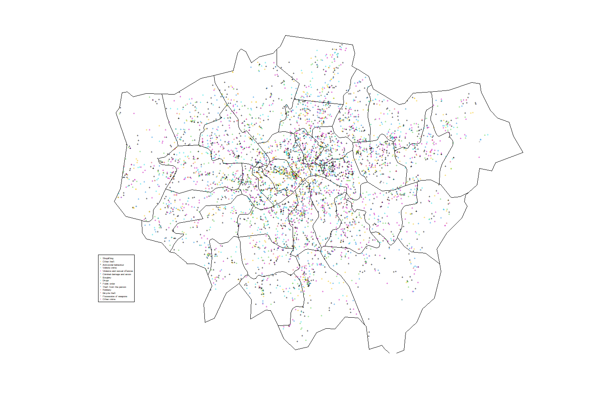
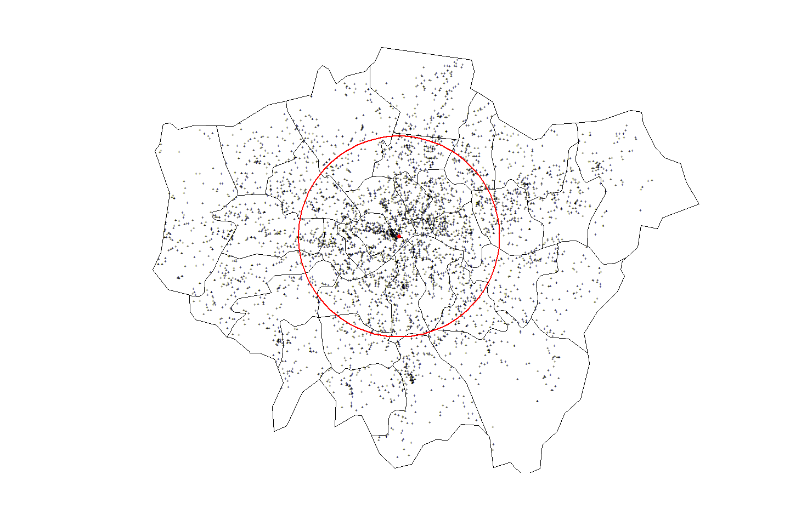
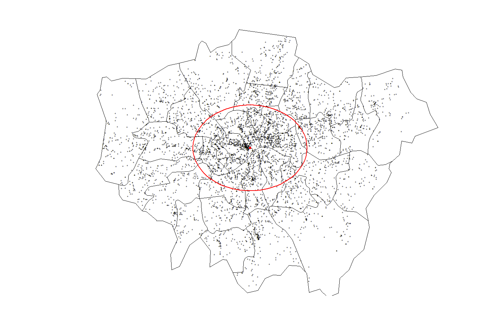
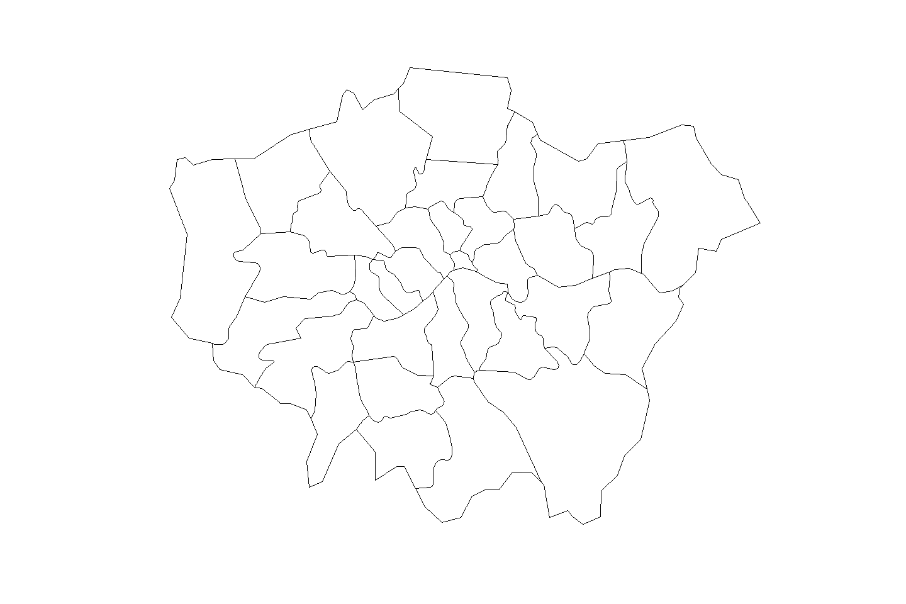
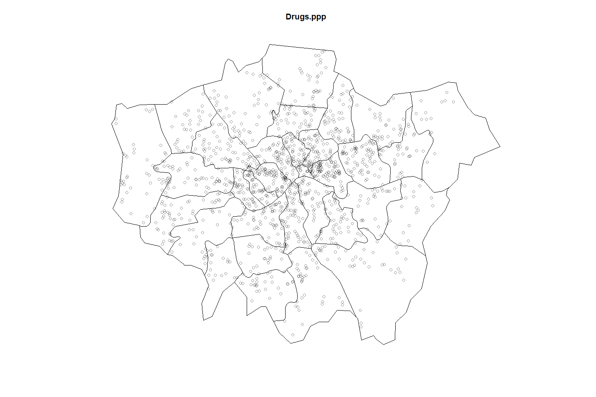
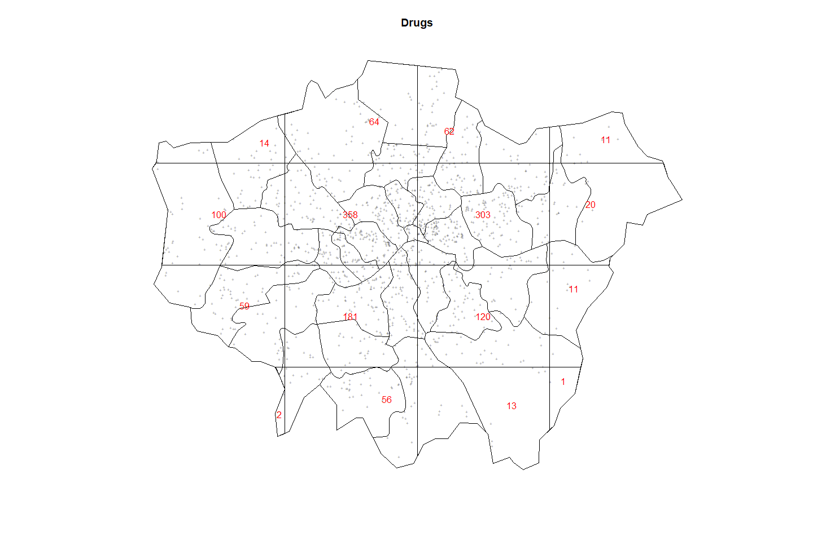
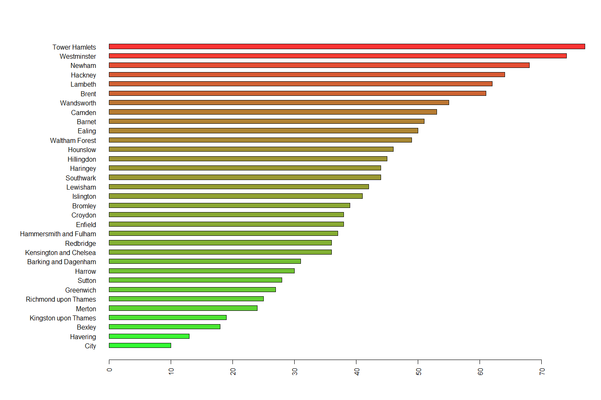
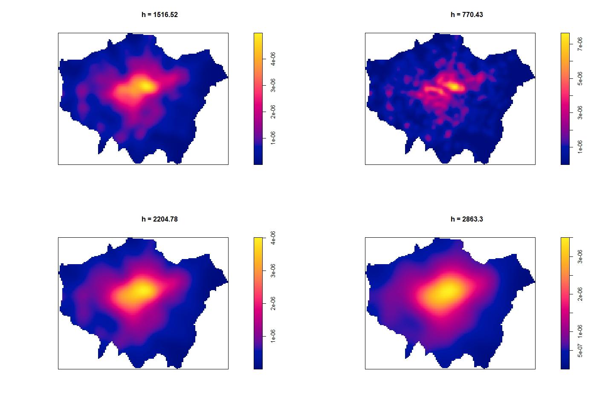
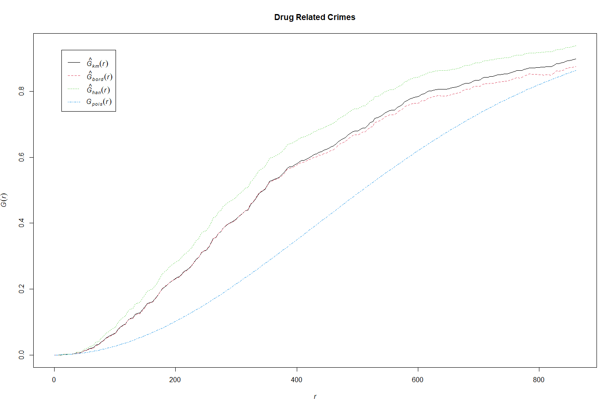

Laboratorio 2
================
Jesús Guzmán Castillo
10/9/2020

``` r
library(sp)  
library(spatstat)  
library(raster)  
library(maptools)  
library(plotrix)  
library(rgeos)  
```

# Introducción

La policia británica da acceso libre a los archivos sobre crímenes
ocurridos en ese país en formato abierto, lo que posibilita su uso. Los
crímenes son georeferenciados de tal forma que es posible ubicar la gran
mayoria de los crímenes espacialmente. En este ejemplo, el objetivo es
determinar la incidencia de los crímenes espacialmente mediante un
análisis puntual, y así identificar si existe un patrón espacial, y si
lo hay, establecer la intensidad de estos según la localidad en que se
lleva a cabo.

Para Bivand, Pebesma y Gómez-Rubio, “un proceso puntual es un proceso
estocástico en el que observamos la ubicación de algunos acontecimientos
de interés dentro de una región delimitada A”. De igual forma, citando a
Möller y Waagepetersen (2003), afirma que en un proceso puntual, se
llamará un patrón de puntos serán los lugares de los acontecimientos
generados por un proceso puntual en la zona de estudio A.(p. 155)

Para los autores " El análisis de patrones de puntos se centra en la
distribución espacial de los eventos observados y en la inferencia del
proceso subyacente que los generó. En particular, hay dos cuestiones
principales de interés: la distribución de los acontecimientos en el
espacio y la existencia de posibles interacciones entre ellos."
(p. 160).

En este trabajo se desarrollará esto, y más adelante se trabajará con la
descripción de la intensidad

# Desarrollo

## Preparación de los datos.

Se cargan los datos de los delitos ocurridos en Londres en los meses de
mayo y junio de 2014, y luego se eliminan los crímenes en que no existe
la referencia de latitud y longitud. Luego se presentan las variables
que contiene la base de datos.

``` r
library(readr)
data <- read_csv("london_street.csv")
data <- data[!is.na(data$Longitude)&!is.na(data$Latitude),]  
str(data)
```

    tibble [5,000 x 14] (S3: tbl_df/tbl/data.frame)
     $ X1                   : num [1:5000] 86142 35052 81151 35159 70976 ...
     $ Crime.ID             : chr [1:5000] "a0feda8c2ab111cd313b875520387d493b14f82e546afd687e725737d667aa4a" "732d6aaa37de0db60aeb3814ccf7163bed49f5b6f717c4ebc3303c08c2022c8a" "985de970c47ec885ca30fc402db92a3efd64f1096c4aa2602af072ea2d012ce4" NA ...
     $ Month                : chr [1:5000] "2014-06" "2014-06" "2014-06" "2014-06" ...
     $ Reported.by          : chr [1:5000] "Metropolitan Police Service" "Metropolitan Police Service" "Metropolitan Police Service" "Metropolitan Police Service" ...
     $ Falls.within         : chr [1:5000] "Metropolitan Police Service" "Metropolitan Police Service" "Metropolitan Police Service" "Metropolitan Police Service" ...
     $ Longitude            : num [1:5000] -0.195 -0.111 -0.253 -0.106 -0.142 ...
     $ Latitude             : num [1:5000] 51.4 51.4 51.5 51.4 51.4 ...
     $ Location             : chr [1:5000] "On or near High Street" "On or near Supermarket" "On or near Priests Bridge" "On or near Hood Close" ...
     $ LSOA.code            : chr [1:5000] "E01004140" "E01001005" "E01003857" "E01001013" ...
     $ LSOA.name            : chr [1:5000] "Sutton 012B" "Croydon 019A" "Richmond upon Thames 003F" "Croydon 020B" ...
     $ Crime.type           : chr [1:5000] "Shoplifting" "Shoplifting" "Other theft" "Anti-social behaviour" ...
     $ Last.outcome.category: chr [1:5000] "Offender given penalty notice" "Investigation complete; no suspect identified" "Investigation complete; no suspect identified" NA ...
     $ Context              : logi [1:5000] NA NA NA NA NA NA ...
     $ optional             : logi [1:5000] TRUE TRUE TRUE TRUE TRUE TRUE ...

Luego de cargar la base de datos, se convierte en un archivo de tipo
espacial, indicando que las variables de coordenadas son longitud y
latitud. Además, se comprobarán los puntos repetidos, en donde se
observa que existen en total 585 puntos. Los puntos repetidos puede ser
porque se reportan los crímenes más de una vez, o porque hay más de una
persona implicada. Sin embargo, no se pueden eliminar sin tener
información de referencia, porque podría ser que en un lugar específico
se den dos crímenes en el periodo de estudio. Por ende, se debe de
trabajar con cuidado el eliminar los puntos que son repetidos.

``` r
coordinates(data)=~Longitude+Latitude
zero <- zerodist(data)
length(unique(zero[,1]))
```

    [1] 585

Una vez que se tiene el archivo de datos con la localización de los
puntos en latitud y longitud, se debe de cargar el *shapefile* de la
ciudad de Londres. Esto está en la base de datos de
**natutalearthdata**, y se puede extraer con el siguiente código.

``` r
download.file("http://www.naturalearthdata.com/http//www.naturalearthdata.com/download/10m/cultural/ne_10m_admin_1_states_provinces.zip",destfile="ne_10m_admin_1_states_provinces.zip")
unzip("ne_10m_admin_1_states_provinces.zip",exdir="NaturalEarth")
border <- shapefile("NaturalEarth/ne_10m_admin_1_states_provinces.shp")
GreaterLondon <- border[paste(border$region)=="Greater London",]  
```

Existen algunos registros que indican que están en la ciudad de Londres,
pero realmente sucedieron en alguna otra ciudad, o fuera de los límites
de la región denominada ***Greater London***. Por lo tanto, se deben
unir las proyecciones de los datos con el *shapefile* de Londres para
que se eliminen esos datos. Cuando se unen ambos archivos, aquellos
datos que no están dentro de la ciudad quedan identificados en la
variable creada *over* como *NA*. Dichos valores perdidos hay que
eliminarlos, pues el área de interés es Londres.

``` r
projection(data)=projection(border)  
overlay <- over(data,GreaterLondon)  
data$over <- overlay$adm1_code  
data.London <- data[!is.na(data$over),]  
```

## Análisis descriptivo.

En total se trabajará con 4955 casos. Lo primero que se realizará es un
cartograma para observar la distribución de los crímenes en la ciudad,
divididos según el tipo de crímen.

``` r
summary(data.London$Crime.type)
```

``` 
   Length     Class      Mode 
     4955 character character 
```

``` r
plot(data.London,pch="+",cex=0.5,main="",col=as.factor(data.London$Crime.type))
plot(GreaterLondon,add=T)
legend(x=-0.53,y=51.41,pch="+",col=unique(as.factor(data.London$Crime.type)),legend=unique(as.factor(data.London$Crime.type)),cex=0.4)
```



Cómo parte del análisis descriptivo se calculará la distancia estándar,
que es una medida de variancia entre el promedio de la variancia de los
puntos del punto central. En este caso, se realiza con la fórmula

\(\ d= \sqrt\frac{\sum(xi-ux)^2 + (yi-uy)^2}{n}\)

La distancia estándar es una estadística útil ya que proporciona una
medida de resumen única de la distribución de entidades alrededor del
centro (similar al modo en que una desviación estándar mide la
distribución de los valores de datos alrededor del valor medio de la
estadística). (Fuente:
<https://desktop.arcgis.com/es/arcmap/10.3/tools/spatial-statistics-toolbox/standard-distance.htm#>:\~:text=La%20distancia%20est%C3%A1ndar%20es%20una,valor%20medio%20de%20la%20estad%C3%ADstica).)

``` r
mean_centerX <- mean(data.London@coords[,1])
mean_centerY <- mean(data.London@coords[,2])
 
standard_deviationX <- sd(data.London@coords[,1])
standard_deviationY <- sd(data.London@coords[,2])
 
standard_distance <- sqrt(sum(((data.London@coords[,1]-mean_centerX)^2+(data.London@coords[,2]-mean_centerY)^2))/(nrow(data.London)))


plot(data.London,pch="+",cex=0.5,main="")
plot(GreaterLondon,add=T)
points(mean_centerX,mean_centerY,col="red",pch=16)
draw.circle(mean_centerX,mean_centerY,radius=standard_distance,border="red",lwd=2)
```


En la figura se muestra el centroide, de tipo que es el punto central
del mapa, y el círculo rojo grande incluye los puntos que están en un
radio de 1 distancia estándar del centro. Sin embargo, este tiene el
problema que existen algunas zonas con pocos crímenes (en el mapa se ven
como espacios en blanco). Por ello, se procede a realizar el mismo
procedimiento, pero con la diferencia que se utilizará elipse en vez de
un círculo. Con esto, se eliminan algunos espacios con poca intensidad
de los puntos. Esto se da porque el elipse logra identificar la
distancia entre los puntos según sea latitud o longitud.

``` r
plot(data.London,pch="+",cex=0.5,main="")
plot(GreaterLondon,add=T)
points(mean_centerX,mean_centerY,col="red",pch=16)
draw.ellipse(mean_centerX,mean_centerY,a=standard_deviationX,b=standard_deviationY,border="red",lwd=2)
```



## Análisis de crímenes relacionados con drogas.

En esta sección se enfocará en los crímenes relacionados con drogas. En
esta sección, al solo trabajar con los datos de los crímenes
relacionados con drogas, si se eliminarán los duplicados.

``` r
Drugs <- data.London[data.London$Crime.type==unique(data.London$Crime.type)[3],]
Drugs <- remove.duplicates(Drugs)
```

Ahora, se procede a tranformar los datos de drogas y el **shapefile** a
formato UTM. Una vez esto, se crea la ventana con la figura de Londres.

``` r
library(spatstat)
#Transform GreaterLondon in UTM
GreaterLondonUTM <- spTransform(GreaterLondon,CRS("+init=epsg:32630"))
Drugs.UTM <- spTransform(Drugs,CRS("+init=epsg:32630"))

#Transforming the SpatialPolygons object into an owin object for spatstat, using a function in maptools

window <- as.owin(GreaterLondonUTM)
plot (GreaterLondonUTM)
```



Además, se crea el objeto con patrón de puntos, usando la base de datos
con la información de los crímenes relacionados con drogas, sobre la
ventana de Londres.

``` r
Drugs.ppp <- ppp(x=Drugs.UTM@coords[,1],y=Drugs.UTM@coords[,2],window=window)
plot(Drugs.ppp)
```



``` r
GreaterLondonUTM <- spTransform(GreaterLondon,CRS("+init=epsg:32630"))
```

## Cálculo de intensidad y densidad

Para Bivand, Pebesma y Gómez-Rubio “la intensidad y la densidad espacial
son parte de las propiedades de primer orden porque miden la
distribución de los eventos en la región de estudio. Ni la intensidad
ni la densidad espacial dan ninguna información sobre la interacción
entre dos puntos arbitrarios. Esto se mide por las propiedades de
segundo orden, que reflejan cualquier tendencia de los eventos a
aparecer agrupados de forma independiente, o espaciada regularmente.”
(p.163)

Ahora, se puede realizar el cálculo de la intensidad de los delitos de
drogas. Para ello, se utiliza como numerador el total de puntos en la
ventana, y como denominador la suma de todas las areas dentro de la
ventana.

``` r
Drugs.ppp$n/sum(sapply(slot(GreaterLondonUTM, "polygons"), slot, "area"))
```

    [1] 8.566451e-07

Según los mismos autores, la intensidad puede ser homogenea o no,
dependiendo si es constante en el área. En este caso, se divide la
ventana en rectangulos para medir si la intensidad es homogenea en toda
el área de estudio. Como se observa en el siguiente mapa, la intensidad
es variable según el rectángulom, por lo que no es homogenea.

``` r
plot(Drugs.ppp,pch="+",cex=0.5,main="Drugs")
plot(quadratcount(Drugs.ppp, nx = 4, ny = 4),add=T,col="red")
```



Con esta información, se puede establecer mejor la intensidad por cada
uno de los poblados de la ciudad de Londres. Con ello, sabiendo que esta
no es homogénea, se puede determinar cuales ciudades tienen una mayor
intensidad de delitos en su área.

``` r
Local.Intensity <- data.frame(Borough=factor(),Number=numeric())
for(i in unique(GreaterLondonUTM$name)){
sub.pol <- GreaterLondonUTM[GreaterLondonUTM$name==i,]
 
sub.ppp <- ppp(x=Drugs.ppp$x,y=Drugs.ppp$y,window=as.owin(sub.pol))
Local.Intensity <- rbind(Local.Intensity,data.frame(Borough=factor(i,levels=GreaterLondonUTM$name),Number=sub.ppp$n))
}
```

En este gráfico es posible observar la distribución de la intensidad en
las distintas localidades. Se muestra como en Tower Hamlets

``` r
colorScale <- color.scale(Local.Intensity[order(Local.Intensity[,2]),2],color.spec="rgb",extremes=c("green","red"),alpha=0.8)
par(mar=c(5,13,4,2)) 
barplot(Local.Intensity[order(Local.Intensity[,2]),2],names.arg=Local.Intensity[order(Local.Intensity[,2]),1],horiz=T,las=2,space=1,col=colorScale)
```



La distribución espacial de la intensidad se puede determinar tambien
con la suavización del núcleo, en donde se calcula la intensidad de
forma continua en toda la ventana de estudio. En este caso, es más
importante, como se vio en clase, definir el ancho de banda que el tipo
de núcleo. No existe una fórmula para determinarlo, pero el autor señala
que si es muy pequeña generará mucho ruido, pero si es muy grande puede
pasar elementos cruciales del patrón de puntos.

``` r
par(mfrow=c(2,2))
plot(density.ppp(Drugs.ppp, sigma = bw.diggle(Drugs.ppp),edge=T),main=paste("h =",round(bw.diggle(Drugs.ppp),2)))
plot(density.ppp(Drugs.ppp, sigma = bw.ppl(Drugs.ppp),edge=T),main=paste("h =",round(bw.ppl(Drugs.ppp),2)))
plot(density.ppp(Drugs.ppp, sigma = bw.scott(Drugs.ppp)[2],edge=T),main=paste("h =",round(bw.scott(Drugs.ppp)[2],2)))
plot(density.ppp(Drugs.ppp, sigma = bw.scott(Drugs.ppp)[1],edge=T),main=paste("h =",round(bw.scott(Drugs.ppp)[1],2)))
```


En este caso, el h más pequeño es de 770.43, con el que se observa una
precisión que parecería mayor que en los otros, sin embargo el centro se
denota menor intensidad, algo que se reflejan con los otros anchos de
banda. Conforme crece este valor, el centro se ve con un nivel de
intensidad mayor, pero se pierde información sobre los extremos del
mapa, pues se empieza a ver un azul más sólido, mientras que con menores
valores de H, se tiene que se observan variaciones en la escala de
color.

## Prueba G

En términos sencillos, “La función G mide la distribución de las
distancias de una su evento más cercano.” (Para Bivand, Pebesma y
Gómez-Rubio ,p.161)

``` r
plot(Gest(Drugs.ppp),main="Drug Related Crimes")
```


Este gráfico se debe comparar con los patrones de comportamineto. Al
observarlo, se ve como queda bajo el supuesto que existen patrones de
comportamiento.

# Conclusiones

El análisis de patrones puntuales que se llevó a cabo nos muestra como
existen clusters en cuento a la delictividad por drogas en la ciudad de
Londres. Esto no solo nos lo dice la función G, sino que el análisis de
la intensidad nos muestra como en el centro de la ciudad se tienen la
mayoria de los crímenes por drogas en Londres. Con esto, se pudo cumplir
con los objetivos señalados, ya que se demostró que la intensidad varia,
y que si existen patrones de comportamiento, en especifico agrupaciones
que se denotan con concentraciones de delitos en el centro, reflejado
con una intensidad mayor, y en la periferia menores delitos asociados
con drogas.
