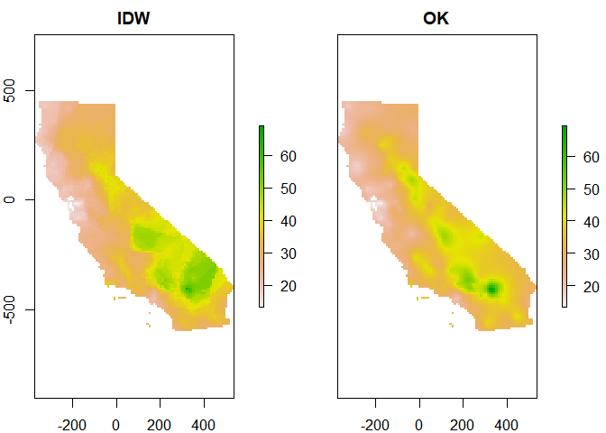
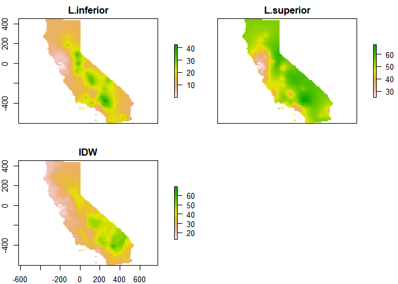

Labaratorio 3 respuestas
================
Jesús Guzmán Castillo
12/10/2020

# **Métodos de interpolación no geoestadísticos**

Los métodos de interpolación no geoestadísticos son aquellos métodos
espaciales que buscan realizar interpolación pero no modelan la
correlación espacial. En este caso, se tienen los métodos de
Interpolación don pesos de distancia inversa, la regresión lineal, o
los métodos proximidad de polígonos, entre otros.

## Datos de precipitación en el Estado de California.

**Introducción** Para esta primera sección se utilizarán los datos de
precipitación del Estado de California.

## Pregunta 1.

**Describe what each step in the code chunk does**

``` r
set.seed(5132015)
kf <- kfold(nrow(dta))
rmse <- rep(NA, 5)
for (k in 1:5) {
  test <- dta[kf == k, ]
  train <- dta[kf != k, ]
  v <- voronoi(train)
  p <- extract(v, test)
  rmse[k] <- RMSE(test$prec, p$prec)
}
```

    ## Loading required namespace: deldir

    ## Loading required namespace: rgeos

``` r
rmse
```

    ## [1] 199.0686 187.8069 166.9153 191.0938 238.9696

``` r
mean(rmse)
```

    ## [1] 196.7708

``` r
1 - (mean(rmse) / null)
```

    ## [1] 0.5479875

En este chunk de programa una validación cruzada para la función de
interpolación mediante polígonos de proximidad. En este caso, se hace
con una base de *training* y una base de *testing*, y se calcula el
rmsea comparando los valores predichos del modelo entrenado con los
datos de *testing*, versus los datos reales en la base de *testing*. Al
final, se calcula su media y se compara con el modelo nulo, el cual se
calculo anteriormente. El modelo nulo se trata de interpolar únicamente
con la media.

## Pregunta 2

**How does the proximity-polygon approach compare to the NULL model?**

Como se observa, la razón del RMSEA entre ambos modelos es de 0.5479875,
con lo que se concluye que es mejor la interpolación con la función de
polígonos de proximidad.

## Pregunta 3

**You would not typically use proximty polygons for rainfall data. For
what kind of data would you use them?**

Probablemente lo usaría para datos de tipo categóricos u ordinales, no
para datos contínuos, como es la lluvia.

## Pregunta 4

**IDW generated rasters tend to have a noticeable artefact. What is
that?**

Con este método, pareciera que la interpolación muestra una
concentración, pues hacia el norte la intensidad de la precipitación se
ve mayor, mientras que hacie el sur se ve una precipitación mucho menor.
Si bien es cierto al observar el mapa 1 se muestra que esto es cierto,
en el sur-oeste se observa que hay mayor precipitación que la observada
en el mapa con la interpolación IDW. Los artefactos son los puntos en
blanco, que son los puntos en donde se tienen mediciones, por lo que no
se debe interpolar.

## Pregunta 5

**Inspect the arguments used for and make a map of the IDW model below.
What other name could you give to this method (IDW with these
parameters)? Why?**

``` r
gs2 <- gstat(formula=prec~1, locations=dta, nmax=1, set=list(idp=1))
```

En este caso el idp al ser únicamente estaría usando el inverso, no
elevaría a ninguna potencia para construir los pesos. Por ende,yo lo
llamaría interpolación por pesos simples de distancia

\#Interpolación con métodos geoestadísticos

Los modelos geoestadísticos son aquellos que queremos ver la asociacion
entre la variable respuesta y su distancia. Se busca modelar la
correlación entre los puntos y la variable respuesta.

## Datos de contaminación del aire en California

Para esta sección se utilizará como variable respuesta la contaminación
del aire en el estado de California.

## Pregunta 6

**Which method performed best?**

De los tres métodos el que tiene un mejor ajuste según el RMSEA es el
método de Kriging, pues el método número 4 es de consenso entre los
diversos métodos.

## Pregunta 7

**Show where the largest difference exist between IDW and OK**

<!-- -->

La mayor diferencia entre ambos mapas se concentra en la parte sur del
estado, en donde el método de interpolación con pesos inversos da
valores mayores de contaminación que usando el método de interpolación
de Kringing.

## Pregunta 8

**Show where the difference between IDW and OK is within the 95%
confidence limit of the OK prediction.**

``` r
k <- gstat(formula=OZDLYAV~1, locations=train, model=fve)
j<-gstat(formula=OZDLYAV~1, locations=train, model=idw)
# predicted values
k1 <- predict(k, g)
```

    ## [using ordinary kriging]

``` r
p<-(k1$var1.pred)
var<-sqrt(kp$var1.var)


li<-p-1.96*var
ls<-p+1.96*var

idm <- gstat(formula=OZDLYAV~1, locations=aq)
idp <- interpolate(r, idm)
```

    ## [inverse distance weighted interpolation]

``` r
j<-idp$var1.pred[1:9555]
a<-rep(0, 9555)
for(i in 1:9555){
if (j[i]<ls[i]&j[i]>li[i]) 
{
  a[i]<-1
}
}
summary (a)
```

    ##    Min. 1st Qu.  Median    Mean 3rd Qu.    Max. 
    ##  0.0000  1.0000  1.0000  0.9967  1.0000  1.0000

Un 99% de los valores predichos del método de interpolación de pesos
inversos caen dentro de los intervalos de confianza creados con los
valores predichos del método de Kriging. Como se dijo en la pregunta
anterior, las diferencias más importantes se encuentran en la zona del
sur este, por lo que es probable que sea en esta región en donde se
muestran la mayoría de los puntos que tienen una diferencia
significativa entre los puntos.

<!-- -->

Si construimos los mapas de los intervalos de confianza para OK, se
puede observar con más detalle esta diferencia

``` r
k2 <- brick(k1)

p1<-brick(k2$var1.pred) + sqrt(brick(k2$var1.var))*1.96
p2 <- mask(p1, ca)
p3<-brick(k2$var1.pred) - sqrt(brick(k2$var1.var))*1.96
p4 <- mask(p3, ca)
p5 <- stack(p4,p2, idw)
names(p5) <- c('L.inferior', 'L.superior' , "IDW")
plot(p5)
```

<!-- -->

## Pregunta 9

**Can you describe the pattern we are seeing, and speculate about what
is causing it?**

El patrón que se muestra se da en la región sureste del estado de
California, precisamente en donde se encuentra el desierto de Arizona.
Es esta región, por las características propias del lugar, se tienen
mediciones que pueden considerarse extremas, por la calidad del aire que
uno puede encontrar ahí. Por ese motivo, es que los métodos de
interpolación pueden variar.
