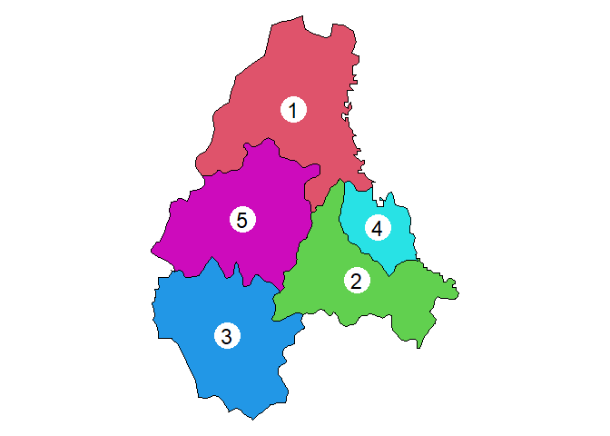
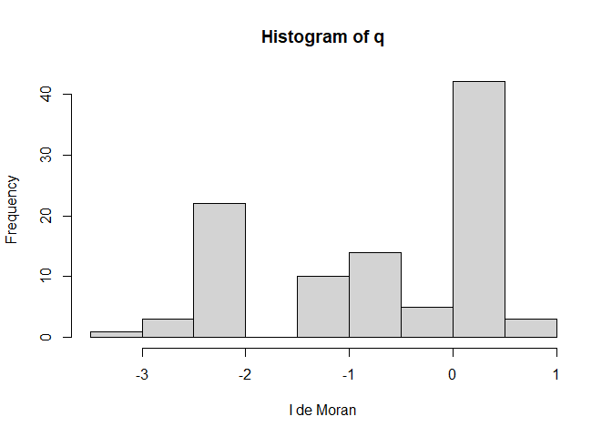
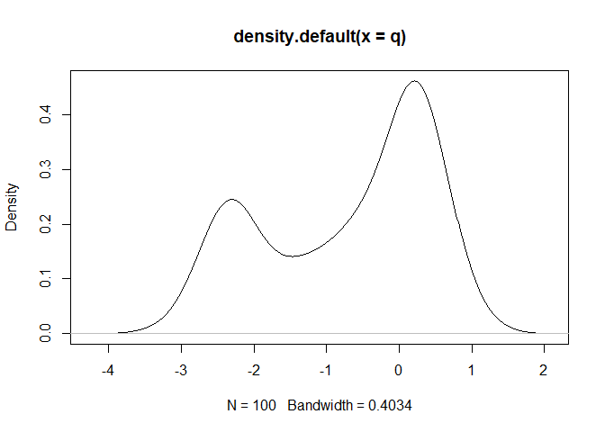

Laboratorio 5
================
Jesús Guzmán Castillo
11/11/2020

**Introducción** En este laboratorio se trabajará sobre el concepto de
autocorrelación espacial, que busca la relación de una misma variable
según sus vecinos. A diferencia de las series de tiempo, la
autocorrelación espacial no tiene una única direccionalidad, sino que
tiene al menos dos.

Los datos son de una región en Luxemburgo denominada Diekirch, en donde
se toma como variable de interés el área de cada una de las ciudades. El
autor señala que “la autocorrelación espacial en la variable”AREA“. Si
hubiera autocorrelación espacial, las regiones de tamaño similar se
agruparían espacialmente”

<!-- -->

``` r
str(w)
```

    ## List of 5
    ##  $ : int [1:3] 2 4 5
    ##  $ : int [1:4] 1 3 4 5
    ##  $ : int [1:2] 2 5
    ##  $ : int [1:2] 1 2
    ##  $ : int [1:3] 1 2 3
    ##  - attr(*, "class")= chr "nb"
    ##  - attr(*, "region.id")= chr [1:5] "0" "1" "2" "3" ...
    ##  - attr(*, "call")= language poly2nb(pl = p, row.names = p$Id)
    ##  - attr(*, "type")= chr "queen"
    ##  - attr(*, "sym")= logi TRUE

**Question 1:Explain the meaning of the first 5 lines returned by
str(w)** Las primeras 5 lineas que retorna indican los vecinos de cada
una de las ciudades. Así, la ciudad 1 tiene como vecinos la 2,4 y 5; la
ciudad 2 con la 1,3,4 y 5; la 3 con las ciudades 2 y 5, la 4 con las
ciudades 1 y 2; y en la ciudad 5 con las ciudades 1,2 y 3.

``` r
vr <- n / sum(dy^2)
```

``` r
moran.test(p$value, ww, randomisation=FALSE)
```

    ## 
    ##  Moran I test under normality
    ## 
    ## data:  p$value  
    ## weights: ww    
    ## 
    ## Moran I statistic standard deviate = 2.3372, p-value = 0.009714
    ## alternative hypothesis: greater
    ## sample estimates:
    ## Moran I statistic       Expectation          Variance 
    ##         0.1728896        -0.2500000         0.0327381

``` r
moran.mc(p$value, ww, nsim=99)
```

    ## 
    ##  Monte-Carlo simulation of Moran I
    ## 
    ## data:  p$value 
    ## weights: ww  
    ## number of simulations + 1: 100 
    ## 
    ## statistic = 0.17289, observed rank = 98, p-value = 0.02
    ## alternative hypothesis: greater

**Question 2: How do you interpret these results (the significance
tests)?**

La hipótesis se rechaza, dado que el valor p es menor a 0.05. Por ende,
se puede concluir que existe autocorrelación parcial

**Question 3: What is the maximum value we can use for nsim?**

El valor máximo es 120, ya que son las permutaciones que permite con el
número de valores, que son 5. Por ende, el factorial de 5 es 120.

**Question 4: Show how to use the ‘geary’ function to compute Geary’s
C**

En este caso, el test de Geary sigue la misma lógica del test de Moran.
En este caso, como se rechaza la hipótesis nula, por lo que se concluye
que se tiene autocorrelación.

**Question 5: Write your own Monte Carlo simulation test to compute
p-values for Moran’s I, replicating the results we obtained with the
function from spdep. Show a histogram of the simulated values.**

``` r
n<-100
q<-rep(0,n)
for (i in 1:99) {
  x<-sample(p$value)
  xlag<-lag.listw(ww,x)
  mod1<-lm(xlag~x)
  q[i]<-coef(mod1)[2]
}

hist (q, xlab="I de Moran")
```

<!-- -->

``` r
plot(density(q))
```

<!-- -->
