Laboratorio 1
================
Jesús Guzmán Castillo
27/8/2020

# **Sección 1.3**

## Pregunta 1

Read the shapefile storms\_xyz\_feature from the shape directory in the
sf package

``` r
library (stars)
storm = st_read(system.file("shape/storms_xyz_feature.shp", package="sf"), crs = 4267)
```

    Reading layer `storms_xyz_feature' from data source `C:\Users\Jesus\Documents\R\win-library\4.0\sf\shape\storms_xyz_feature.shp' using driver `ESRI Shapefile'
    Simple feature collection with 71 features and 1 field
    geometry type:  LINESTRING
    dimension:      XYZ
    bbox:           xmin: -102.2 ymin: 8.3 xmax: 0 ymax: 59.5
    z_range:        zmin: 924 zmax: 1017
    geographic CRS: NAD27

``` r
storm
```

    Simple feature collection with 71 features and 1 field
    geometry type:  LINESTRING
    dimension:      XYZ
    bbox:           xmin: -102.2 ymin: 8.3 xmax: 0 ymax: 59.5
    z_range:        zmin: 924 zmax: 1017
    geographic CRS: NAD27
    First 10 features:
         Track                       geometry
    1     TONY LINESTRING Z (-50.8 20.1 10...
    2    SANDY LINESTRING Z (-77.4 14.3 10...
    3   RAFAEL LINESTRING Z (-62.7 14.7 10...
    4    PATTY LINESTRING Z (-72.5 25.5 10...
    5    OSCAR LINESTRING Z (-38 12.4 1008...
    6   NADINE LINESTRING Z (-38 15.5 1008...
    7  MICHAEL LINESTRING Z (-36.7 28.9 10...
    8   LESLIE LINESTRING Z (-27.4 12.9 10...
    9     KIRK LINESTRING Z (-43.4 23.9 10...
    10   JOYCE LINESTRING Z (-31.7 10.7 10...

``` r
save.image(file = "storm.RData")
```

## Pregunta 2

Copy this file to another directory on your computer, and read it from
there (note: a shapefile consists of more than one file\!)

``` r
#write( storm, file = "storm.RData")
#load("storm.RData")
```

## Pregunta 3

How many features does this dataset contain?

``` r
storm
```

    Simple feature collection with 71 features and 1 field
    geometry type:  LINESTRING
    dimension:      XYZ
    bbox:           xmin: -102.2 ymin: 8.3 xmax: 0 ymax: 59.5
    z_range:        zmin: 924 zmax: 1017
    geographic CRS: NAD27
    First 10 features:
         Track                       geometry
    1     TONY LINESTRING Z (-50.8 20.1 10...
    2    SANDY LINESTRING Z (-77.4 14.3 10...
    3   RAFAEL LINESTRING Z (-62.7 14.7 10...
    4    PATTY LINESTRING Z (-72.5 25.5 10...
    5    OSCAR LINESTRING Z (-38 12.4 1008...
    6   NADINE LINESTRING Z (-38 15.5 1008...
    7  MICHAEL LINESTRING Z (-36.7 28.9 10...
    8   LESLIE LINESTRING Z (-27.4 12.9 10...
    9     KIRK LINESTRING Z (-43.4 23.9 10...
    10   JOYCE LINESTRING Z (-31.7 10.7 10...

El dataset contiene unicamente lineas. En este caso, al ser un archivo
sobre la trayectoria de las tormentas, se trata de un solo tipo de
geometría, que son líneas.

## Pregunta 4

Plot the dataset, with axes = TRUE (hint: before plotting, pipe through
st\_zm to drop Z and M coordinates; more about this in chapter 3).

``` r
library (dplyr)
storm %>% st_transform(4326) %>% st_zm() -> st1
st1 %>% plot(graticule = TRUE, axes = TRUE)
```

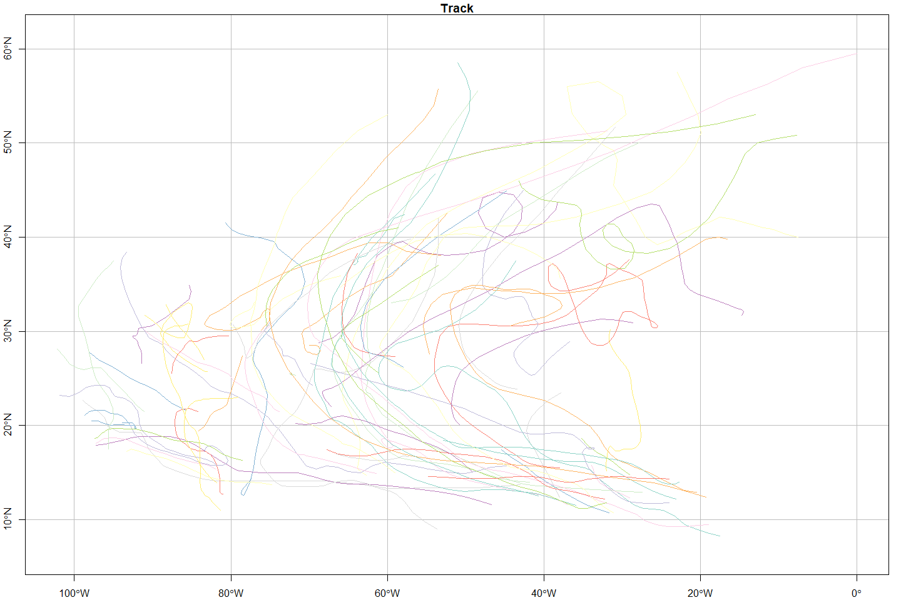

``` r
suppressPackageStartupMessages(library(mapview))
#st1 %>% mapview(legend = TRUE, col.regions = sf.colors)
```

# **Sección 2.6**

## Pregunta 1

Convert the (x,y) (x,y) points (10,2), (−10,−2), (10,−2) and (0,10) to
polar coordinates

``` r
rho1<-sqrt(10^2+2^2)
rho2<-sqrt(10^2+2^2)
rho3<-sqrt(10^2+2^2)
rho4<-sqrt(0+10^2)
theta1<-atan2(2,10)
theta2<-atan2(-2,-10)
theta3<-atan2(-2,10)
theta4<-atan2(10,0)

(p1<-c(rho1,theta1))
```

    [1] 10.1980390  0.1973956

``` r
(p2<-c(rho2,theta2))
```

    [1] 10.198039 -2.944197

``` r
(p3<-c(rho3,theta3))
```

    [1] 10.1980390 -0.1973956

``` r
(p4<-c(rho4,theta4))
```

    [1] 10.000000  1.570796

## Pregunta 2

Convert the polar (r,ϕ) points (10,45∘) , (0,100∘) ) and (5,359∘) to
Cartesian coordinates

``` r
x1=10*cos((45*pi)/180)
y1=10*sin((45*pi)/180)

x2=0*cos((100*pi)/180)
y2=0*sin((100*pi)/180)

x3=5*cos((359*pi)/180)
y3=5*sin((359*pi)/180)

(p1<-c(x1,y1))
```

    [1] 7.071068 7.071068

``` r
(p2<-c(x2,y2))
```

    [1] 0 0

``` r
(p3<-c(x3,y3))
```

    [1]  4.99923848 -0.08726203

## Pregunta 3

Assuming the Earth is a sphere with a radius of 6371 km, compute for
(λ,ϕ) points the great circle distance between ( 10 , 10 ) and (11,10)
, between(10,80) and (11,80), between (10,10) and (10,11) and between
(10,80) and (10,81) (units: degree). What are the distance units?

``` r
x<-c(10,11,10,11,10,10,10,10)
y<-c(10,10,80,80,10,11,80,81)

xi<-(x*pi)/180
yi<-(y*pi)/180
r<-6371
d1<-acos(sin(yi[1])*sin(yi[2])+cos(yi[1])*cos(yi[2])*cos(abs(xi[1]-xi[2])))

(d1<-d1*r)
```

    [1] 109.5056

``` r
d2<-acos(sin(yi[3])*sin(yi[4])+cos(yi[3])*cos(yi[4])*cos(abs(xi[3]-xi[4])))

(d2<-d2*r)
```

    [1] 19.30856

``` r
d3<-acos(sin(yi[5])*sin(yi[6])+cos(yi[5])*cos(yi[6])*cos(abs(xi[5]-xi[6])))

(d3<-d3*r)
```

    [1] 111.1949

``` r
d4<-acos(sin(yi[7])*sin(yi[8])+cos(yi[7])*cos(yi[8])*cos(abs(xi[7]-xi[8])))

(d4<-d4*r)
```

    [1] 111.1949

La unidad de distancia son kilómetros

# **Sección 4.4**

## Pregunta 1

NDVI, normalized differenced vegetation index, is computed as
(NIR-R)/(NIR+R), with NIR the near infrared and R the red band. Read the
L7\_ETMs.tif file into object x, and distribute the band dimensions over
attributes by split(x, “band”). Then, compute NDVI by using an
expression that uses the NIR (band 4) and R (band 3) attributes
directly.

``` r
tif = system.file("tif/L7_ETMs.tif", package = "stars")
library(stars)
x = read_stars(tif)
split(x, "band")
```

    stars object with 2 dimensions and 6 attributes
    attribute(s):
          X1               X2               X3               X4         
     Min.   : 47.00   Min.   : 32.00   Min.   : 21.00   Min.   :  9.00  
     1st Qu.: 67.00   1st Qu.: 55.00   1st Qu.: 49.00   1st Qu.: 52.00  
     Median : 78.00   Median : 66.00   Median : 63.00   Median : 63.00  
     Mean   : 79.15   Mean   : 67.57   Mean   : 64.36   Mean   : 59.24  
     3rd Qu.: 89.00   3rd Qu.: 79.00   3rd Qu.: 77.00   3rd Qu.: 75.00  
     Max.   :255.00   Max.   :255.00   Max.   :255.00   Max.   :255.00  
          X5               X6         
     Min.   :  1.00   Min.   :  1.00  
     1st Qu.: 63.00   1st Qu.: 32.00  
     Median : 89.00   Median : 60.00  
     Mean   : 83.18   Mean   : 59.98  
     3rd Qu.:112.00   3rd Qu.: 88.00  
     Max.   :255.00   Max.   :255.00  
    dimension(s):
      from  to  offset delta                       refsys point values    
    x    1 349  288776  28.5 UTM Zone 25, Southern Hem... FALSE   NULL [x]
    y    1 352 9120761 -28.5 UTM Zone 25, Southern Hem... FALSE   NULL [y]

``` r
ndvi = function(x) (x[4]-x[3])/(x[4]+x[3])
st_apply(x, c("x","y"), ndvi)
```

    stars object with 2 dimensions and 1 attribute
    attribute(s):
         ndvi          
     Min.   :-0.75342  
     1st Qu.:-0.20301  
     Median :-0.06870  
     Mean   :-0.06432  
     3rd Qu.: 0.18667  
     Max.   : 0.58667  
    dimension(s):
      from  to  offset delta                       refsys point values    
    x    1 349  288776  28.5 UTM Zone 25, Southern Hem... FALSE   NULL [x]
    y    1 352 9120761 -28.5 UTM Zone 25, Southern Hem... FALSE   NULL [y]

## Pregunta 2

Compute NDVI for the S2 image, using st\_apply and an a function ndvi =
function(x) (x\[4\]-x\[3\])/(x\[4\]+x\[3\]). Plot the result, and write
the result to a GeoTIFF. Explain the difference in runtime between
plotting and writing.

``` r
granule = system.file("sentinel/S2A_MSIL1C_20180220T105051_N0206_R051_T32ULE_20180221T134037.zip", package = "starsdata")
file.size(granule)
```

    [1] 769461997

``` r
base_name = strsplit(basename(granule), ".zip")[[1]]
s2 = paste0("SENTINEL2_L1C:/vsizip/", granule, "/", base_name, ".SAFE/MTD_MSIL1C.xml:10m:EPSG_32632")
(p = read_stars(s2, proxy = TRUE))
```

``` 
stars_proxy object with 1 attribute in file:
$`MTD_MSIL1C.xml:10m:EPSG_32632`
[1] "[...]/MTD_MSIL1C.xml:10m:EPSG_32632"

dimension(s):
     from    to offset delta                refsys point values    
x       1 10980  3e+05    10 WGS 84 / UTM zone 32N    NA   NULL [x]
y       1 10980  6e+06   -10 WGS 84 / UTM zone 32N    NA   NULL [y]
band    1     4     NA    NA                    NA    NA   NULL    
```

``` r
s3 = st_apply(p, c("x", "y"), ndvi)
plot (s3)
```

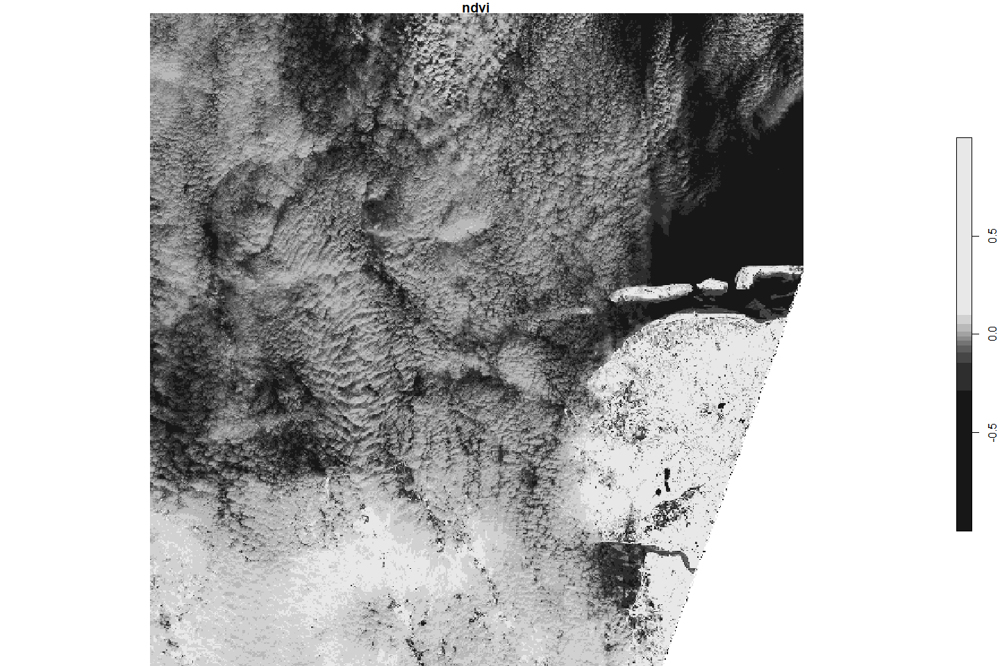

``` r
tf = tempfile(fileext=".tif")
write_stars(s3, tf)
```

    ================================================================================

La diferencia es que plotting genera la representación gráfica del
raster, y el writing escribe esa representación gráfica en la memoria de
la computadora.

## Pregunta 3

Use st\_transform to transform the stars object read from L7\_ETMs.tif
to EPSG 4326. Print the object. Is this a regular grid? Plot the first
band using arguments axes=TRUE and border=NA, and explain why this takes
such a long time.

``` r
x %>% st_transform(4326)->x1
plot(x1[,,,1], axes=TRUE, border= NA)
```

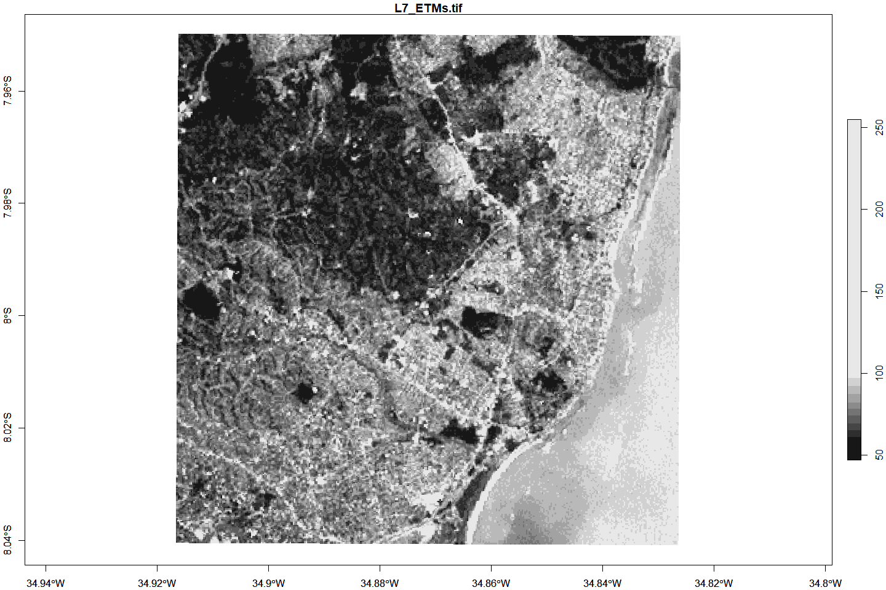

En este caso se dura mucho pues debe de obtener los datos de la base de
datos, es decir debe realizar un cálculo de los datos y readecuarlos
para hacer el mapa.

## Pregunta 4

Use st\_warp to warp the L7\_ETMs.tif object to EPSG 4326, and plot the
resulting object with axes=TRUE. Why is the plot created much faster
than after st\_transform?

``` r
st_crs(4326)->y1
x2 = st_warp(x, crs = y1)
plot (x2[,,,1])
```

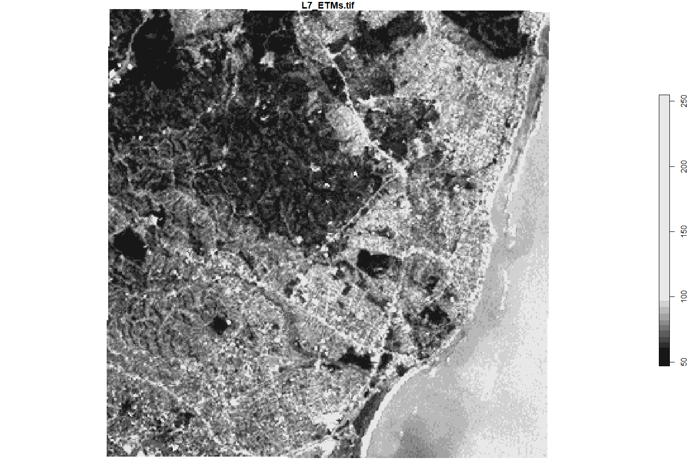
Este gráfico es más rápido pues primero se hace la transformación y
luego se hace el gráfico. Al hacer el gráfico no se debe de reconfigurar
los datos.

# **Sección 6.6**

## Pregunta 1

Add a variable to the nc dataset by nc$State = “North Carolina”. Which
value should you attach to this variable for the attribute-geometry
relationship (agr)?

``` r
nc <- system.file("gpkg/nc.gpkg", package="sf") %>%
    read_sf() %>%
    st_transform(4326)
nc$STATE= "North Carolina"

nc1 <- nc %>%
    st_set_agr(c(NAME = "Identity", STATE = "constant"))
```

Se agrega el valor de **constante** pues todos los estados tendrán el
mismo valor \#\# Pregunta 2

Create a new sf object from the geometry obtained by st\_union(nc), and
assign “North Carolina” to the variable State. Which agr can you now
assign to this attribute variable?

``` r
nc%>% st_union(by_feature = F)->nc2
nc2
```

    Geometry set for 1 feature 
    geometry type:  MULTIPOLYGON
    dimension:      XY
    bbox:           xmin: -84.32377 ymin: 33.88212 xmax: -75.45662 ymax: 36.58973
    geographic CRS: WGS 84

``` r
class (nc2)
```

``` 
[1] "sfc_MULTIPOLYGON" "sfc"             
```

``` r
plot(nc2)
```

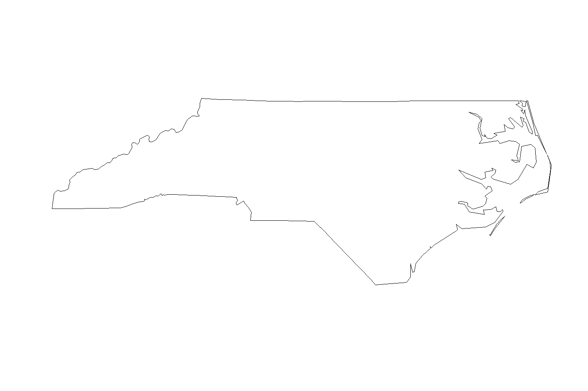
Acá sería de tipo “identity” pues es el nombre distintivo del estado que
estamos graficando.

## Pregunta 3

Use st\_area to add a variable with name area to nc. Compare the area
and AREA variables in the nc dataset. What are the units of AREA? Are
the two linearly related? If there are discrepancies, what could be the
cause?

``` r
nc$area<-st_area(nc)
View(cbind(nc$AREA, nc$area))
```

Las discrepancias mostradas son por la escala en que están los datos. En
la variable original de la base están en base de km2, mientras que el
cálculo lo hace en m2. Además, existe un redondeo en la variable
original.

## Pregunta 4

Is the area variable intensive or extensive? Is its agr equal to
constant, identity or aggregate?

Es extensiva, no está truncado el número. Es agregada.

## Pregunta 5

Find the name of the county that contains POINT(-78.34046 35.017)

``` r
library (stars)
library (sf)
p <- st_as_sf(data.frame(city = c("a"),
           lat = c(35.017),
           lon = c(-78.34046)), coords = c("lon", "lat"), crs = 4326)

a<-st_point(c(-78.34046,35.017))

c<-st_contains(nc, p)
c <- summary(c) 
c1 <- as.numeric( c[,1])
pos <- which( c1==1 )
nc$NAME[pos]
```

    [1] "Sampson"

## Pregunta 6

Find the names of all counties with boundaries that touch county
Sampson.

``` r
Sampson<-nc$geom[pos]
d<-st_intersects(nc, Sampson)
d <- summary(d) 
d1 <- as.numeric( d[,1])
pos1 <- which( d1==1 )
nc$NAME[pos1]
```

``` 
[1] "Johnston"   "Wayne"      "Harnett"    "Sampson"    "Cumberland"
[6] "Duplin"     "Bladen"     "Pender"    
```

## Pregunta 7

List the names of all counties that are less than 50 km away from county
Sampson.

``` r
e<-st_is_within_distance(nc,Sampson,50000)
e <- summary(e) 
e1 <- as.numeric( e[,1])
pos2 <- which( e1==1 )
nc$NAME[pos2]
```

``` 
 [1] "Wake"        "Chatham"     "Wilson"      "Johnston"    "Greene"     
 [6] "Lee"         "Wayne"       "Harnett"     "Moore"       "Lenoir"     
[11] "Sampson"     "Cumberland"  "Jones"       "Hoke"        "Duplin"     
[16] "Onslow"      "Robeson"     "Bladen"      "Pender"      "Columbus"   
[21] "New Hanover" "Brunswick"  
```

# **Sección 8**

``` r
library(sf)
library(raster)
library(dplyr)
library(spData)
library(spDataLarge)
library(tmap)
library(leaflet) 
library(ggplot2) 

africa = world %>% 
  filter(continent == "Africa", !is.na(iso_a2)) %>% 
  left_join(worldbank_df, by = "iso_a2") %>% 
  dplyr::select(name, subregion, gdpPercap, HDI, pop_growth) %>% 
  st_transform("+proj=aea +lat_1=20 +lat_2=-23 +lat_0=0 +lon_0=25")

zion = st_read((system.file("vector/zion.gpkg", package = "spDataLarge")))
```

    Reading layer `zion' from data source `C:\Users\Jesus\Documents\R\win-library\4.0\spDataLarge\vector\zion.gpkg' using driver `GPKG'
    Simple feature collection with 1 feature and 11 fields
    geometry type:  POLYGON
    dimension:      XY
    bbox:           xmin: 302903.1 ymin: 4112244 xmax: 334735.5 ymax: 4153087
    projected CRS:  UTM Zone 12, Northern Hemisphere

``` r
data(nlcd, package = "spDataLarge")
```

## Pregunta 1

Create a map showing the geographic distribution of the Human
Development Index (HDI) across Africa with base graphics (hint: use
plot()) and tmap packages (hint: use tm\_shape(africa) + …). Name two
advantages of each based on the experience. Name three other mapping
packages and an advantage of each. Bonus: create three more maps of
Africa using these three packages.

``` r
tm_shape(africa) +
  tm_fill() 
```


``` r
# Add border layer to nz shape
tm_shape(africa) +
  tm_borders() 
```

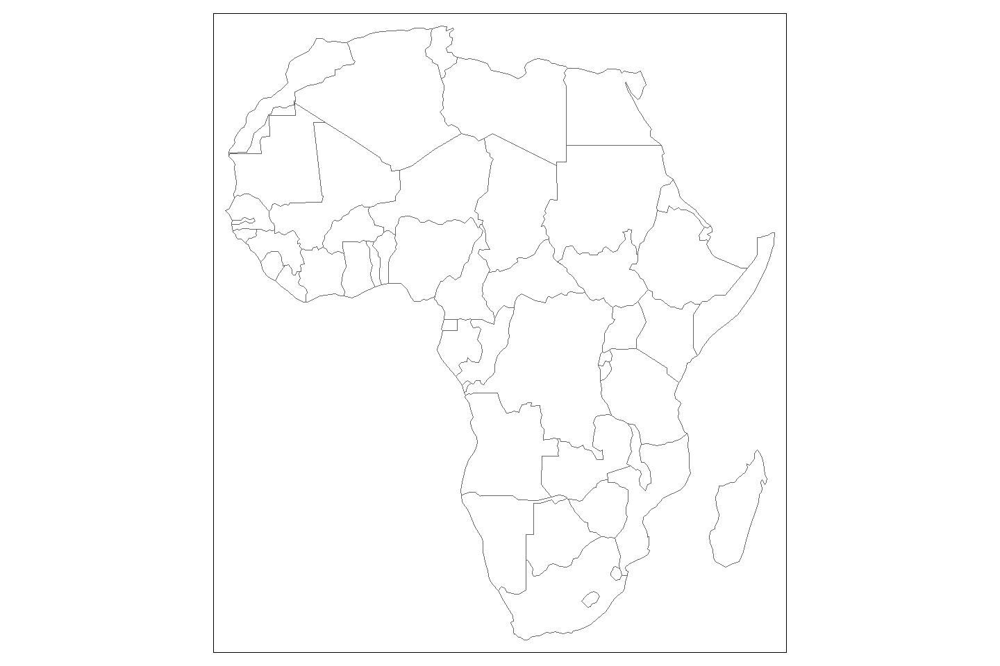

``` r
# Add fill and border layers to nz shape
tm_shape(africa) +
  tm_fill() +
  tm_borders() 
```

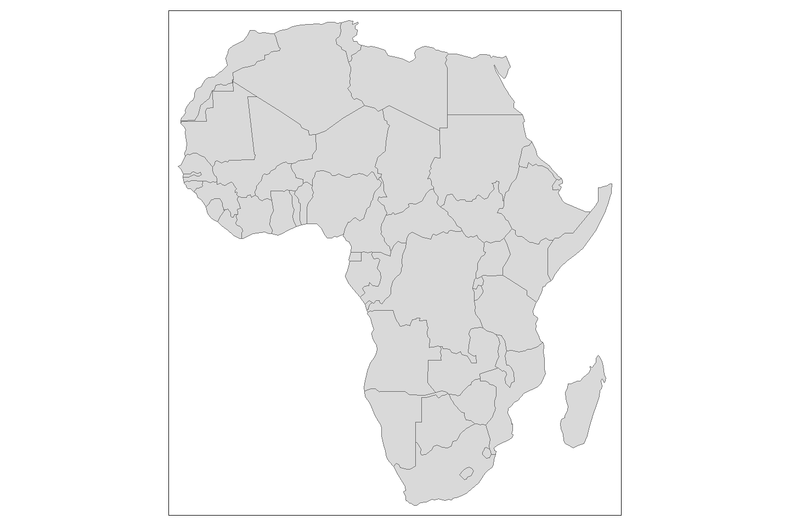

``` r
map_af = tm_shape(africa) + tm_polygons()
map_af1 = map_af +
  tm_shape(africa) +tm_fill(col="HDI", palette = "Greens")
map_af1
```

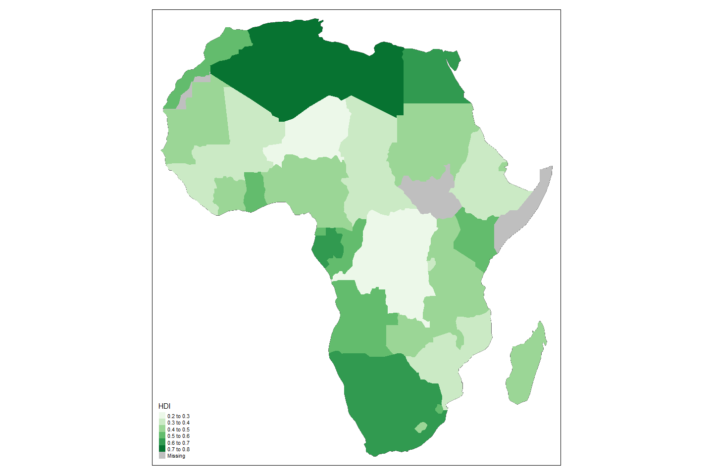

``` r
world_africa  = world %>% 
  filter(continent == "Africa", !is.na(iso_a2)) %>% 
  left_join(worldbank_df, by = "iso_a2") %>% 
  dplyr::select(HDI) 

plot(world_africa)
```

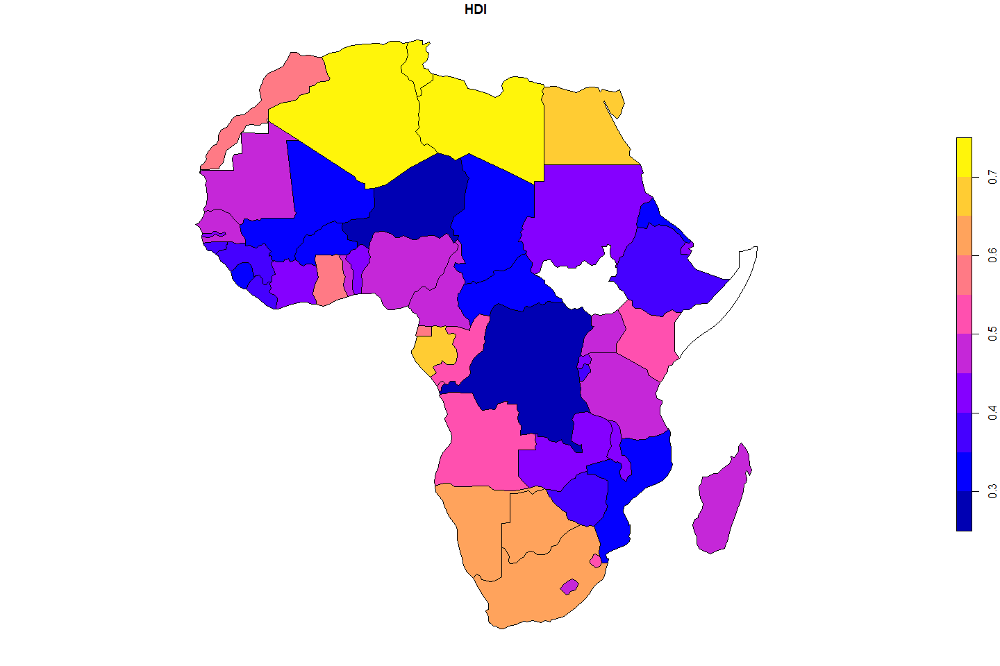

Las ventajas de tmap es que se pueden agregar más capaz y el cambio de
los colores se puede hacer más fácilmente usando las paletas de
Rcolorbrewer. En el caso del plot, la ventaja es que es más fácil hacer
gráficos sencillos, además que la función plot reconoce de manera
inmediata el tipo de gráfico que debe realizarse, según los datos que se
le dan. Otras librerias para hacer mapas son *ggplot*, *cowplot* y
*googleway*

## Pregunta 2

Extend the tmap created for the previous exercise so the legend has
three bins: “High” (HDI above 0.7), “Medium” (HDI between 0.55 and 0.7)
and “Low” (HDI below 0.55). Bonus: improve the map aesthetics, for
example by changing the legend title, class labels and color palette.

``` r
breaks = c(0, 0.55, 0.7, 10) 
map_af3<-tm_shape(africa) + tm_polygons(col = "HDI", breaks = breaks,labels=c("Low","Medium","High"), palette="Blues")  + tm_layout(title= "HDI Africa", bg.color = "lightblue", legend.outside = T, legend.outside.position = "left")
map_af3
```

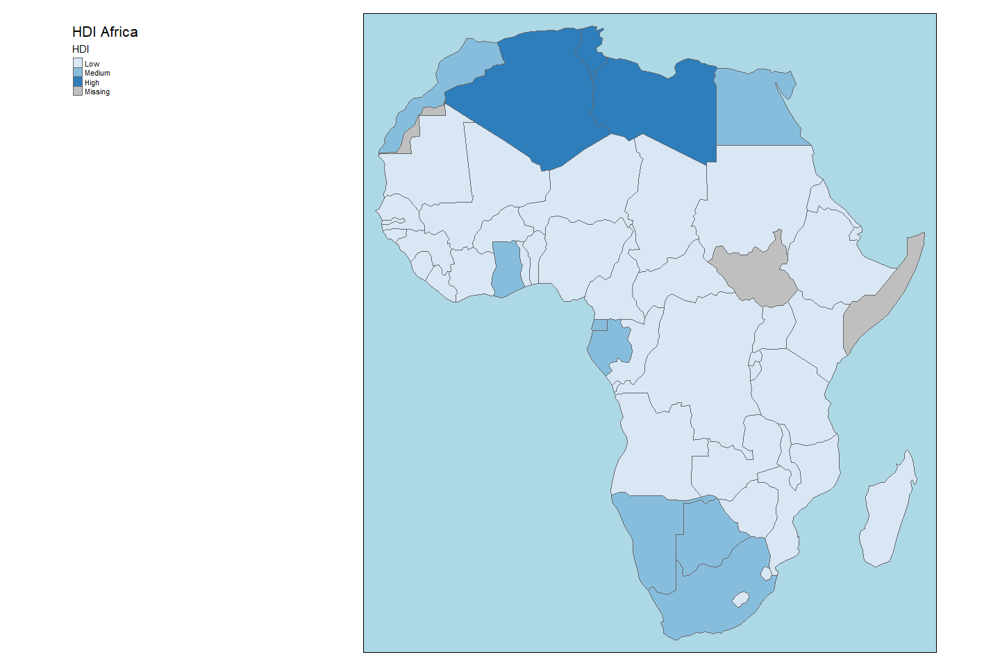

## Pregunta 3

Represent africa’s subregions on the map. Change the default color
palette and legend title. Next, combine this map and the map created in
the previous exercise into a single plot.

``` r
map_af4 = tm_shape(africa) + tm_polygons()
map_af5 = map_af4 +
  tm_shape(africa) +tm_fill(col="subregion", palette = "Reds") + tm_polygons() +tm_layout(title= "Subregiones de africa", bg.color = "lightblue", legend.outside = T, legend.outside.position = "left")

tmap_arrange(map_af3, map_af5)
```

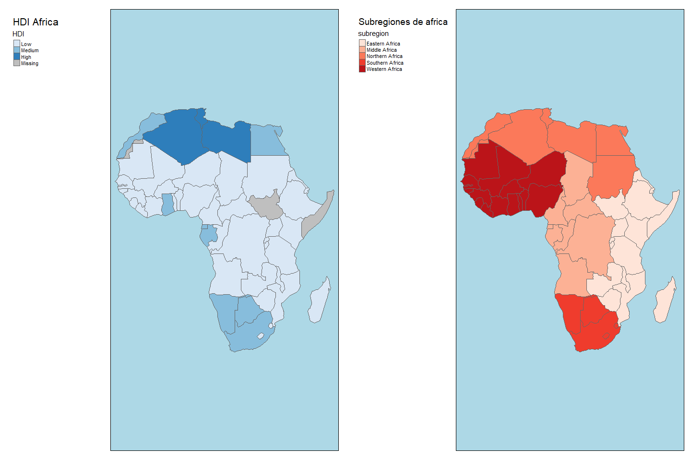

## Pregunta 4

Create a land cover map of the Zion National Park. Change the default
colors to match your perception of the land cover categories Add a scale
bar and north arrow and change the position of both to improve the map’s
aesthetic appeal Bonus: Add an inset map of Zion National Park’s
location in the context of the Utah state. (Hint: an object representing
Utah can be subset from the us\_states dataset.)

``` r
nlcd_masked = mask(nlcd, zion)
plot (nlcd_masked)
```

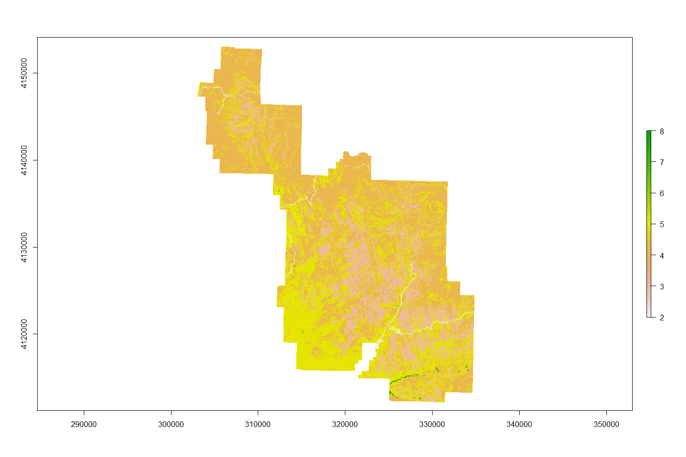

``` r
map_zion1 = tm_shape(zion) + tm_polygons() + tm_compass(type = "8star", position = c("right", "top")) 
map_zion1
```

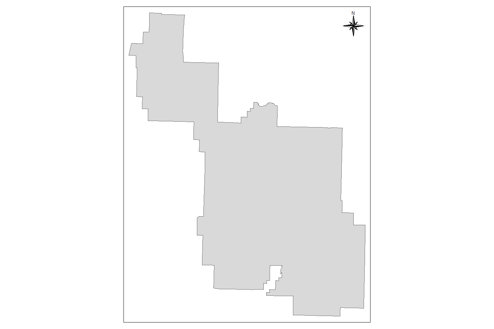

``` r
map_zion2<-map_zion1+tm_polygons(col="nlcd_masked")
map_zion2
```


## Pregunta 5

Create facet maps of countries in Eastern Africa: With one facet showing
HDI and the other representing population growth (hint: using variables
HDI and pop\_growth, respectively) With a ‘small multiple’ per country

``` r
library (dplyr)
library (sf)
library (tmap)
africa1 = africa %>% 
  filter(subregion=="Eastern Africa")

map1<-tm_shape(africa) +
  tm_polygons() +
  tm_shape(africa1) +
  tm_symbols(col = "black", border.col = "white", size = "HDI") +
  tm_facets(by = "subregion", nrow = 2, free.coords = FALSE)

map2<-tm_shape(africa) +
  tm_polygons() +
  tm_shape(africa1) +
  tm_symbols(col = "red", border.col = "white", size = "pop_growth", shape=8 ) +
  tm_facets(by = "subregion", nrow = 2, free.coords = FALSE)

tmap_arrange(map1, map2)
```

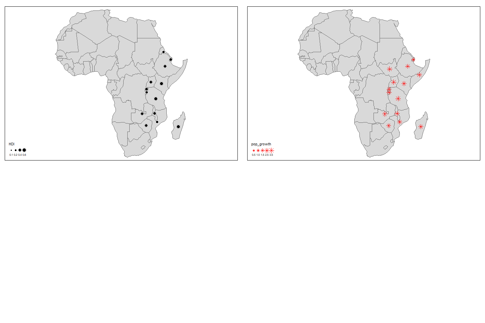

## Pregunta 6

Building on the previous facet map examples, create animated maps of
East Africa: Showing first the spatial distribution of HDI scores then
population growth Showing each country in order

``` r
map3<-tm_shape(africa) +
  tm_polygons() +
  tm_shape(africa1) +
  tm_symbols(col = "black", border.col = "white", size = "HDI")+
  tm_facets(along= "name", by = "subregion", nrow = 2, free.coords = FALSE)+
  tm_shape(africa1) +
  tm_symbols(col = "black", border.col = "white", size = "pop_growth")+
  tm_facets(along= "name", by = "subregion", nrow = 2, free.coords = FALSE)

map3
```

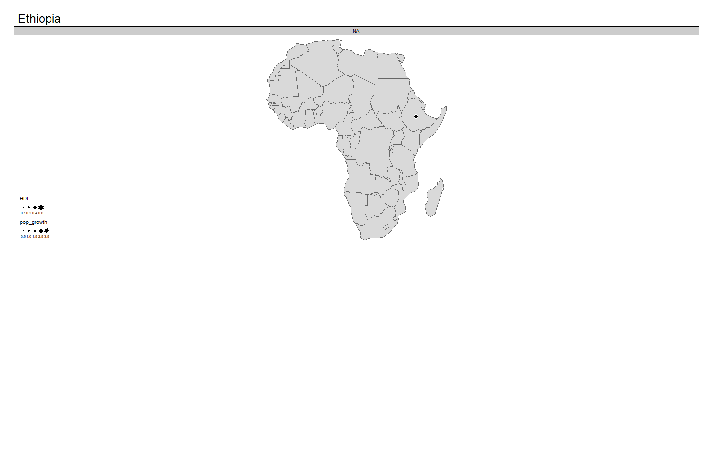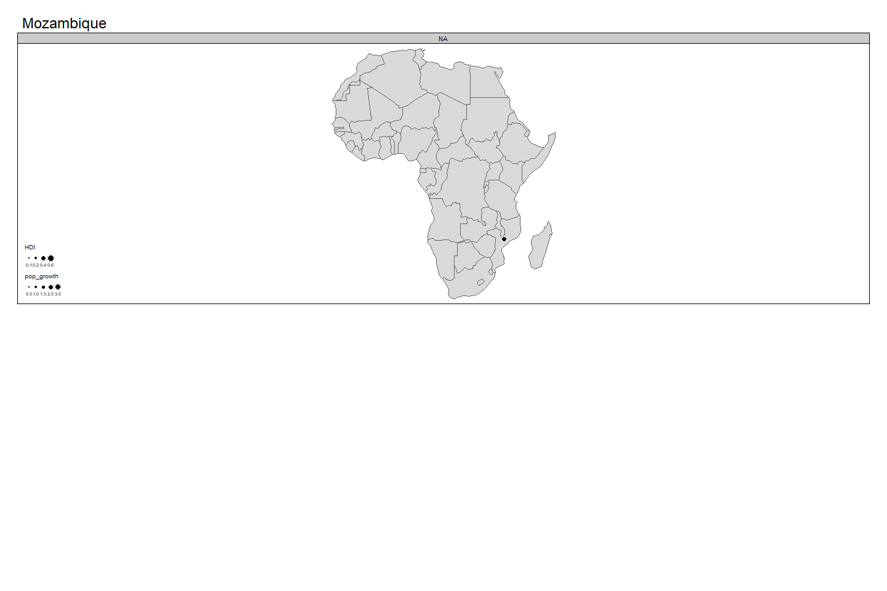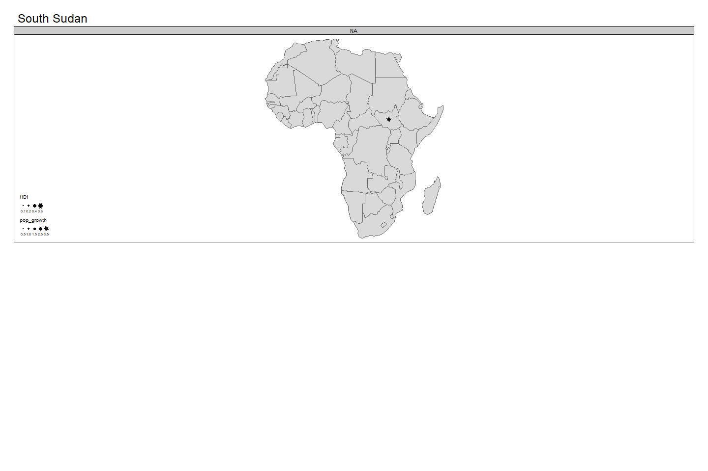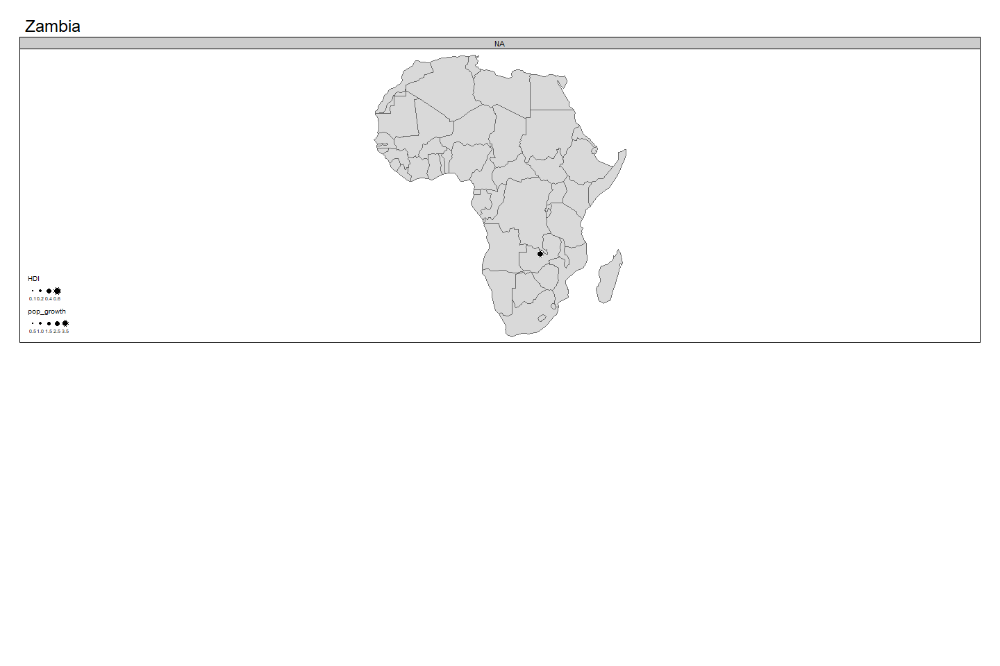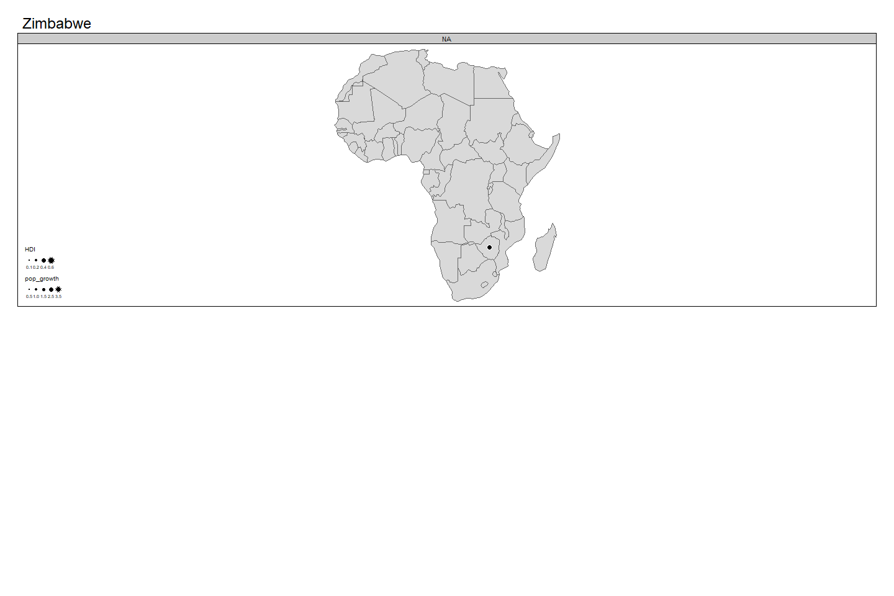

``` r
#tmap_animation(map3, filename = "mapa.gif", delay = 25)
```

En mi caso sale un error al pedirle el gift. Pide tener un programa
instalado, lo instalé siguiendo las instrucciones y continua con el
error.

## Pregunta 7

Create an interactive map of Africa: With tmap With mapview With leaflet
Bonus: For each approach, add a legend (if not automatically provided)
and a scale bar

``` r
library(tmap)
tmap_mode("view")
#map_af3
```

``` r
library(mapview)
#africa %>% mapview(legend = TRUE)
```
