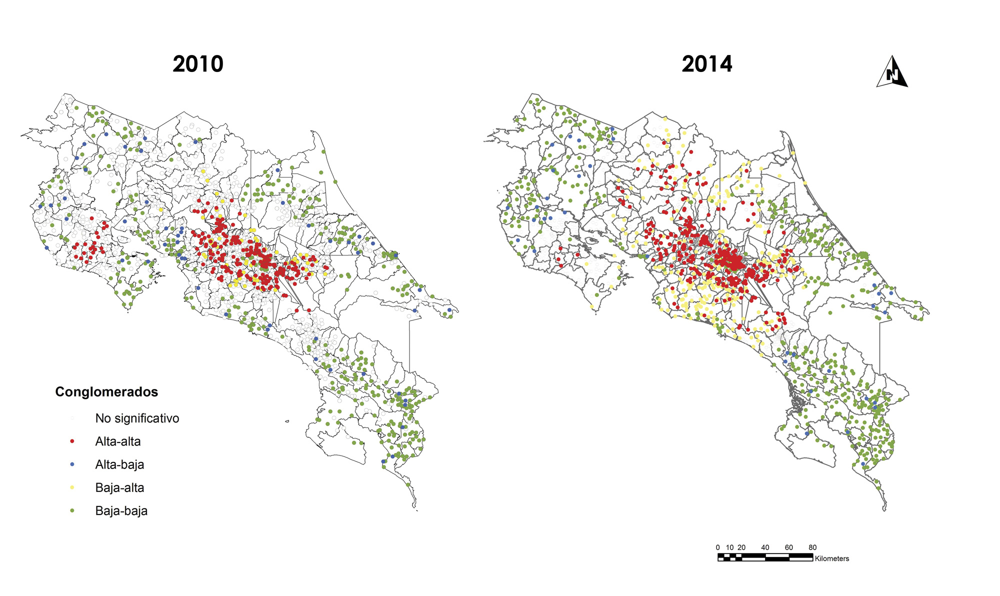

<figure>
  
</figure>

<table style="width:100%">
  <tr>
    <th width="15%"> Fecha </th>
    <th width="25%">  Laboratorio </th>
  </tr>
    <tr>
    <td width="15%"> 20.8.2020 </td>
    <td width="25%">  <a href="Lab/Lab0.md">Lab0</a> </td>
  </tr>
   <tr>
    <td width="15%"> 27.8.2020 </td>
    <td width="25%">  <a href="Proyecto/Anteproyecto.docx">Avance 1</a> </td>
  </tr>
    <tr>
    <td width="15%"> 10.9.2020 </td>
    <td width="25%">  <a href="Lab/Lab1.md">Lab1</a> </td>
  </tr>
  <tr>
    <td width="15%"> 24.9.2020 </td>
    <td width="25%">  <a href="Lab/Lab 2/Lab-2.md">Lab2</a> </td>
  </tr>
    <tr>
    <td width="15%"> 01.10.2020 </td>
    <td width="25%">  <a href="Proyecto/Anteproyecto 2 -.pdf">Avance 2</a> </td>
  </tr>
   <tr>
    <td width="15%"> 24.9.2020 </td>
    <td width="25%">  <a href="Lab/Lab 3/Lab-2-final.md">Lab3</a> </td>
  </tr>
  
</table>
